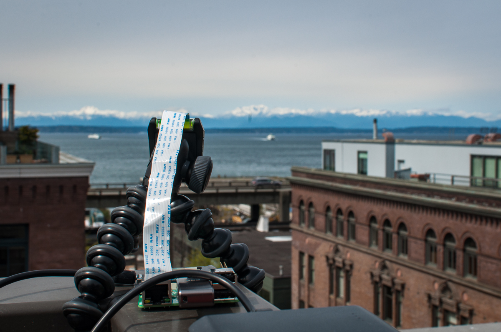

# Easy Forward

##### Capstone Project!
Brian J Lee, created March 2017.

## Description

Easy Forward is an Internet of Things(IoT) platform for Time lapse photography, built using ~~Tessel 2 development board~~ Raspberry Pi and incorporating Socket.io, ImageMagic and Express.js.

Authorized and authenticated users can control the camera from anywhere without having to worry about network location—the only requirements are electricity and a stable Internet connection.

Frontend site, which serves as the main access point for controlling the devices as well as viewing and publishing images, is built using Angular 2.4 with TypeScript.

## Installation

### Hardware requirements
This project requires a development board to serve as the remote device. For best performance, use a Raspberry Pi running the latest version of Raspian OS and the RPi camera module. Otherwise, most development boards capable of installing and running Node.js will work with small adjustments to the code.

If using a setup other than Raspberry Pi with the native camera module, a UVC webcam with the appropriate interface for connecting with the development board is required.

All systems will require either sufficient internal memory space or external storage device such as a USB flash drive or an external hard disk.

### Dependencies
Install [Node.js]() [ImageMagick](https://www.imagemagick.org/script/download.php) and [PostgreSQL](https://www.postgresql.org/download/). All are available on [Homebrew](https://brew.sh/) for MacOS.

### Development
Run `yarn` or `npm install` to install dependencies. Run `yarnpkg knex migrate:latest` (or `npm run knex migrate:latest`) and `yarnpkg knex seed:run` (or `npm run knex seed:run`) to initialize database.

Start development server with `yarnpkg start` or `npm start`. `http://localhost:4200` proxies to backend running on `http://localhost:3000` by default.

### Device
#### Raspberry Pi
Initialize device by installing appropriate OS. Code was developed for Raspbian linux but any linux derived distributions should work as long as it can install and run Node.js.

Following the installation of a suitable OS, install the program dependencies. The program requires Node.js and `raspistill`. `raspistill` is likely to be installed with the OS.

To run, navigate to the Raspberry Pi's project directory and run `curl -fsSL 'http://www.easy-fwd.com/tools/install?board=pi' | sh`. The program will run automatically following installation.

To restart the program after a reboot, navigate to the project directory and run `node index.js`.

#### Tessel 2
Initialize [Tessel 2 and T2-CLI](http://tessel.github.io/t2-start/).

To run, navigate to your computer's project directory and run `curl -fsSL 'http://www.easy-fwd.com/tools/install?board=t2' | sh`. The Tessel 2 must be authorized with this computer in order to run the program.

#### Other development boards
Follow instructions for deploying code to your device. The code from T2 can be reused after adjustments to NPM io packages and Johnny Five settings.

## Features

### Project lifecycle
#### Initiate Recording
Select the device to record in the device overview page. 

#### Ongoing Recording
 
Ongoing projects is displayed in the project dashboard with the last uploaded image.

## Technology

#### Frontend
* [Angular2](https://angular.io) with [TypeScript](https://www.typescriptlang.org/) and [RxJS](http://reactivex.io/rxjs/)
* Angular CLI
* [Bootstrap 4.0.0](http://v4-alpha.getbootstrap.com/) with [ng-bootstrap](https://ng-bootstrap.github.io/#/home)

#### Backend
* [Express.js](https://expressjs.com)
* [Socket.io](https://socket.io)
* [ImageMagick](https://www.imagemagick.org/script/index.php)

#### Database
* [PostgreSQL](https://postgresql.org) with [Knex](https://knexjs.org)

#### Storage
* [AWS S3](https://aws.amazon.com/s3/)

#### Device
* Hardware: Raspberry Pi or [Tessel 2](https://tessel.io/)
* Software: Node.js, [Johnny-Five](http://johnny-five.io/) optional

## Further Development

##### Near term 
* Improve styling
* Improve device stability
* Meta tags (service incorporated in Angular 4.0.0, consider migrating once dependencies catch up!)

##### Long term
* NativeScript
* Stepper motor

##### Longer term
* re-write test files